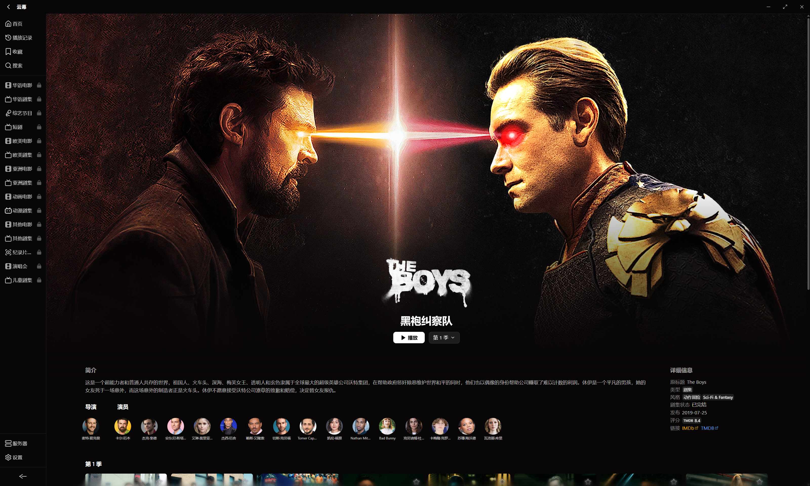
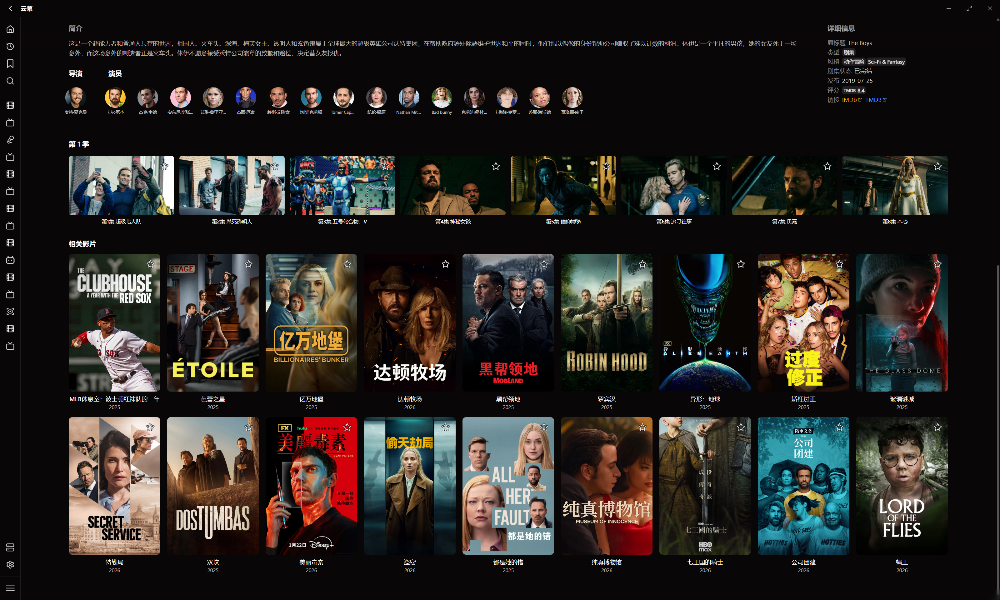

[中文](README.md) | [English](README_EN.md) | **日本語** | [한국어](README_ko.md) | [Русский](README_ru.md)

# 雲幕 · Nimbus Player

**切り替えを減らし、もっと没入。**

Jellyfin、Emby、Plex、FnVideo、ローカルフォルダー、SMB、WebDAV、115 Cloud を一つの Windows デスクトップクライアントに接続し、メディアの閲覧・整理・再生を行えます。

[Microsoft Store からダウンロード](https://apps.microsoft.com/detail/9nzgd27nw89w?hl=ja-JP&gl=JP) · [問題報告](https://github.com/JushiZen/Nimbus.Player/issues) · [Telegram](https://t.me/+Hn3h4sGJohE2ZTll) · [QQグループ](https://qun.qq.com/universal-share/share?ac=1&authKey=LjYdpVHMQlu%2Fm4KaPKGEIVrmMQzhUHlAsb8nPCZpV94NgHIkp43hy%2FX3YWeEKwjm&busi_data=eyJncm91cENvZGUiOiI5NDgwMzYyNzUiLCJ0b2tlbiI6ImgyRGFrbEx2YkRjRkx0dFBuQnRCWURpVHFTNkQ2TmNOUEdjNjZyTWFoRVd2TE9ja2FLTDFOZzcrMzREWDlkSVMiLCJ1aW4iOiI1OTc2MTcxNzQifQ%3D%3D&data=pl-4qcVh0wDEmxyu3FfeCqwg0wtnLT-vs0vphznkKBgMrIHHFuot3D1fdCSqNcoWk0Py6SCutin7tSwPlTCNAA&svctype=4&tempid=h5_group_info)

---

<h2 align="center">すべてのメディアソースを一つのクライアントに</h2>

Nimbus はメディアサーバーではなく、ライブラリをホストすることもありません。既存のサーバーと直接接続するストレージを統一された操作で扱い、閲覧、再生、お気に入り、履歴、続きから再生を一つの Windows アプリにまとめます。

ホームサーバー、NAS、ローカルドライブ、クラウドストレージのどこにあるメディアでも、同じアプリから管理して視聴できます。

---

<h2 align="center">主な機能</h2>

### 統合ライブラリ

- Jellyfin、Emby、Plex、FnVideo に対応
- ローカルフォルダー、SMB、WebDAV、115 Cloud に対応
- 一つのサイドバーから各ソースを切り替え
- ポスターウォール、シンプルリスト、検索、お気に入り、履歴、続きから再生

### 直接接続ライブラリの整理

- 映画、ドラマ、アニメ、バラエティ、音楽などをスキャンして識別
- ポスター、あらすじ、出演者、エピソード情報を補完
- 手動マッチングで識別結果を修正
- 大規模ライブラリのスキャン、再スキャン、分類、情報保存を改善
- 同じ作品のシーズンをまとめ、重複カードを削減

### 再生

- 独立した再生ウィンドウで、視聴中もライブラリを閲覧可能
- 内蔵字幕と外部字幕、表示位置やサイズの調整
- ハードウェアアクセラレーション、色空間、画質プリセット、ネットワークキャッシュ
- Jellyfin、Emby、Plex の複数バージョンから最高ビットレートを優先可能
- ローカルおよびネットワークソースの一般的な ISO、BDMV、DVD コンテンツに対応
- 再生失敗時の診断情報を表示

### アニメとコメント

- アニメ識別とエピソードマッチング
- 複数の一般的なコメントソース
- 速度、サイズ、密度、表示範囲を調整可能
- 再生中にコメント内容を検索して切り替え可能

### 音楽

- 音楽ライブラリの閲覧と再生
- 歌詞表示と単語単位のハイライト
- ローカルおよび WebDAV 音声の埋め込みカバーを表示

---

<h2 align="center">対応ソース</h2>

### メディアサーバー

**Jellyfin / Emby / Plex / FnVideo**

サーバーアドレスとアカウントで接続できます。メタデータ、再生権限、トランスコード、視聴進捗は各サーバーの機能と設定に従います。

### 直接接続ストレージ

**ローカルフォルダー / SMB / WebDAV / 115 Cloud**

ファイルを直接閲覧することも、ローカルライブラリを作成することもできます。スキャン、分類、情報整理は Nimbus が行い、メディアファイルは元のデバイスまたはサービスに保持されます。

---

<h2 align="center">画面プレビュー</h2>

### ホーム

おすすめ、ライブラリ分類、続きから再生を表示します。

### サーバーとライブラリ

サーバーと直接接続ライブラリを一か所で管理します。

### ライブラリ

フィルターと並べ替えに対応したポスターウォールです。

### 詳細

あらすじ、出演者、エピソード、メディアバージョン、関連作品を表示します。

### プレイヤー

独立したプレイヤーウィンドウで字幕、コメント、画質、音声を調整できます。

---

<h2 align="center">データとプライバシー</h2>

- Nimbus がメディアファイルをアップロードまたはホストすることはありません
- サーバー認証情報は OS のセキュリティ機能で保護されます
- アートワーク、メタデータ、視聴履歴、ログは選択したローカルデータフォルダーに保存されます
- オンライン情報、コメント、更新確認、問題報告を使用すると、それぞれのサービスに接続します
- ログでは機密情報をできる限り隠しますが、問題報告前にパスワード、トークン、完全なサーバーアドレス、個人パスを削除してください

---

<h2 align="center">ダウンロードとフィードバック</h2>

Nimbus は [Microsoft Store](https://apps.microsoft.com/detail/9nzgd27nw89w?hl=ja-JP&gl=JP) から配布・更新されます。

このリポジトリは **製品情報と問題追跡** のためのものです。アプリケーションのソースコードは含まれておらず、非公開コードに対する Pull Request は受け付けていません。

問題や提案は [GitHub Issues](https://github.com/JushiZen/Nimbus.Player/issues) で報告してください。アプリのバージョン、メディアソース、再現手順、必要な画像を添付し、パスワード、トークン、完全なサーバーアドレス、個人ファイルのパスは公開しないでください。

---

アプリに表示される第三者の名称、商標、素材はそれぞれの権利者に帰属し、識別と説明の目的でのみ使用されています。
