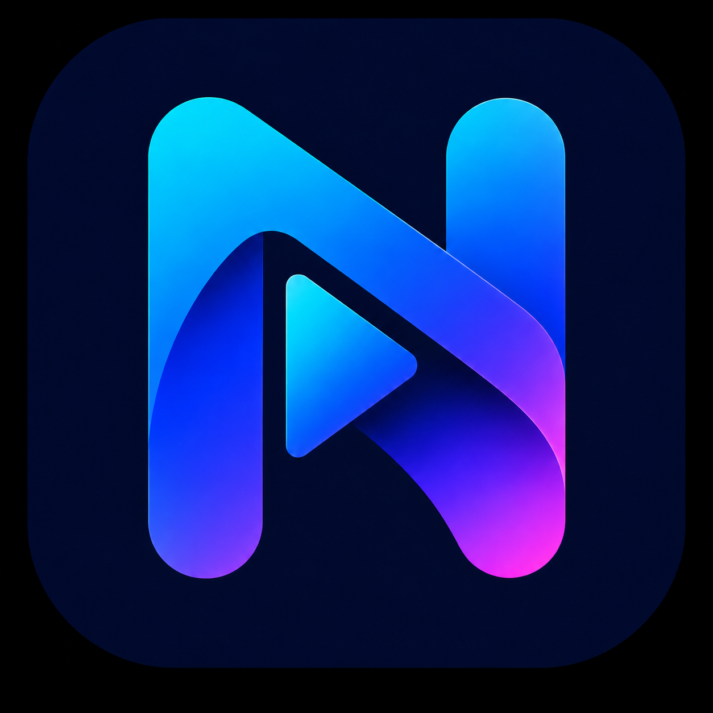
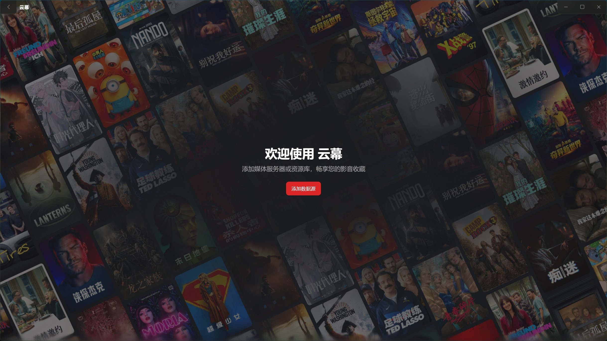
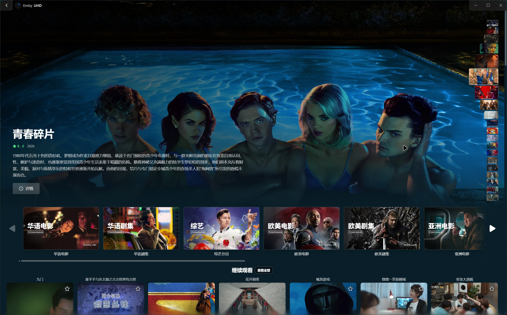
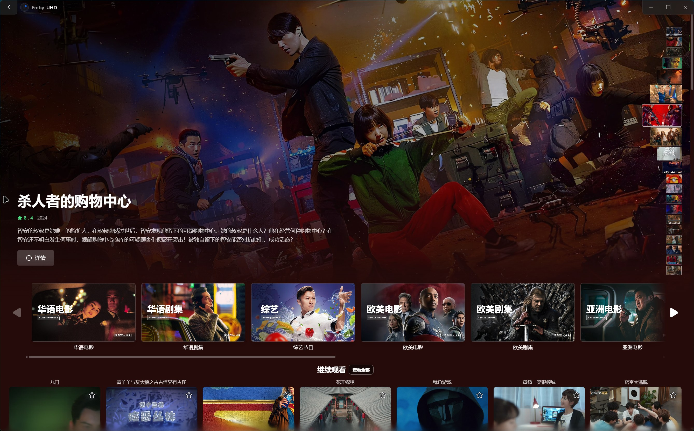
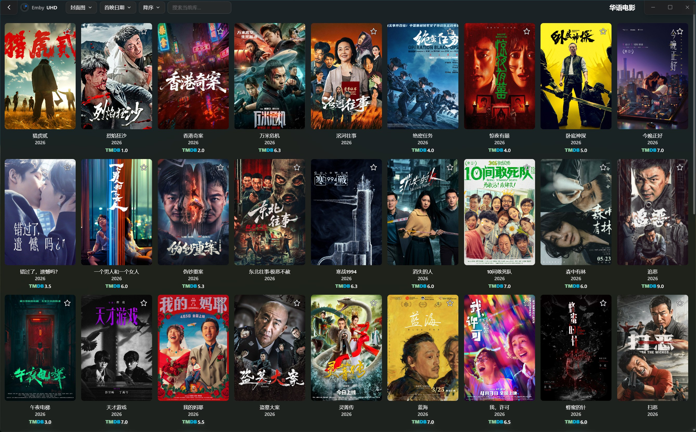
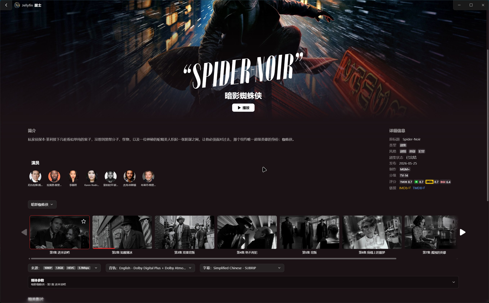
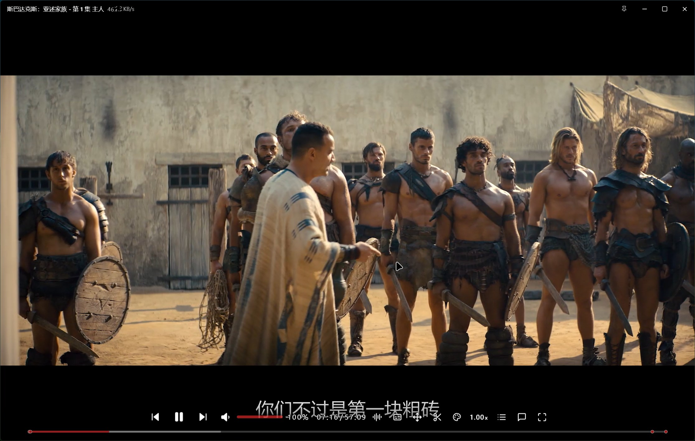

[中文](README.md) | [English](README_EN.md) | [日本語](README_ja.md) | **한국어** | [Русский](README_ru.md)

# 윈무 · Nimbus Player

**전환은 줄이고, 몰입은 더하세요.**

Jellyfin, Emby, Plex, FnVideo, 로컬 폴더, SMB, WebDAV, 115 Cloud를 하나의 Windows 데스크톱 클라이언트에 연결해 미디어를 탐색하고 정리하고 재생할 수 있습니다.

[Microsoft Store에서 다운로드](https://apps.microsoft.com/detail/9nzgd27nw89w?hl=ko-KR&gl=KR) · [문제 신고](https://github.com/JushiZen/Nimbus.Player/issues) · [Telegram](https://t.me/+Hn3h4sGJohE2ZTll) · [QQ 그룹](https://qun.qq.com/universal-share/share?ac=1&authKey=LjYdpVHMQlu%2Fm4KaPKGEIVrmMQzhUHlAsb8nPCZpV94NgHIkp43hy%2FX3YWeEKwjm&busi_data=eyJncm91cENvZGUiOiI5NDgwMzYyNzUiLCJ0b2tlbiI6ImgyRGFrbEx2YkRjRkx0dFBuQnRCWURpVHFTNkQ2TmNOUEdjNjZyTWFoRVd2TE9ja2FLTDFOZzcrMzREWDlkSVMiLCJ1aW4iOiI1OTc2MTcxNzQifQ%3D%3D&data=pl-4qcVh0wDEmxyu3FfeCqwg0wtnLT-vs0vphznkKBgMrIHHFuot3D1fdCSqNcoWk0Py6SCutin7tSwPlTCNAA&svctype=4&tempid=h5_group_info)

---

<h2 align="center">모든 미디어 소스를 위한 하나의 클라이언트</h2>

Nimbus는 미디어 서버가 아니며 사용자의 라이브러리를 호스팅하지 않습니다. 기존 서버와 직접 연결 저장소를 하나의 방식으로 다루고, 탐색, 재생, 즐겨찾기, 기록, 이어보기를 하나의 Windows 앱에서 제공합니다.

홈 서버, NAS, 로컬 드라이브, 클라우드 저장소 어디에 미디어가 있든 같은 앱에서 관리하고 시청할 수 있습니다.

---

<h2 align="center">주요 기능</h2>

### 통합 라이브러리

- Jellyfin, Emby, Plex, FnVideo 지원
- 로컬 폴더, SMB, WebDAV, 115 Cloud 지원
- 하나의 사이드바에서 여러 소스 전환
- 포스터 월, 간단 목록, 검색, 즐겨찾기, 기록, 이어보기

### 직접 연결 라이브러리 정리

- 영화, 시리즈, 애니메이션, 예능, 음악 등을 스캔하고 식별
- 포스터, 줄거리, 출연진, 에피소드 정보 보완
- 수동 매칭으로 잘못된 식별 결과 수정
- 대형 라이브러리의 스캔, 재스캔, 분류, 정보 저장 개선
- 같은 작품의 시즌을 합쳐 중복 카드 감소

### 재생

- 독립 재생 창으로 시청 중에도 라이브러리 탐색 가능
- 내장 및 외부 자막과 표시 설정
- 하드웨어 가속, 색 공간, 화면 프리셋, 네트워크 캐시
- Jellyfin, Emby, Plex의 다중 버전에서 최고 비트레이트 우선 선택 가능
- 로컬 및 네트워크 소스의 일반적인 ISO, BDMV, DVD 콘텐츠 지원
- 재생 실패 시 진단 정보 제공

### 애니메이션과 탄막

- 애니메이션 식별과 에피소드 매칭
- 여러 일반적인 탄막 소스 지원
- 속도, 크기, 밀도, 표시 범위 조절
- 재생 중 탄막 검색과 전환

### 음악

- 음악 라이브러리 탐색과 재생
- 가사 표시와 단어별 강조
- 로컬 및 WebDAV 오디오의 내장 커버 표시

---

<h2 align="center">지원 소스</h2>

### 미디어 서버

**Jellyfin / Emby / Plex / FnVideo**

서버 주소와 계정으로 연결할 수 있습니다. 메타데이터, 재생 권한, 트랜스코딩, 시청 진도는 각 서버의 기능과 설정을 따릅니다.

### 직접 연결 저장소

**로컬 폴더 / SMB / WebDAV / 115 Cloud**

파일을 직접 탐색하거나 로컬 라이브러리를 만들 수 있습니다. Nimbus가 스캔, 분류, 정보 정리를 수행하며 미디어 파일은 원래 장치나 서비스에 그대로 남습니다.

---

<h2 align="center">화면 미리보기</h2>

### 홈

추천, 라이브러리 분류, 이어보기를 확인합니다.

### 서버와 라이브러리

서버와 직접 연결 라이브러리를 한곳에서 관리합니다.

### 라이브러리

필터와 정렬을 지원하는 포스터 월입니다.

### 상세 정보

줄거리, 출연진, 에피소드, 미디어 버전, 관련 작품을 확인합니다.

### 플레이어

독립 플레이어 창에서 자막, 탄막, 화면, 오디오를 조절할 수 있습니다.

---

<h2 align="center">데이터와 개인정보</h2>

- Nimbus는 미디어 파일을 업로드하거나 호스팅하지 않습니다
- 서버 인증 정보는 운영체제의 보안 기능으로 보호됩니다
- 포스터, 메타데이터, 시청 기록, 로그는 사용자가 선택한 로컬 데이터 폴더에 저장됩니다
- 온라인 정보, 탄막, 업데이트 확인, 문제 신고 기능을 사용하면 해당 서비스에 연결됩니다
- 로그는 민감한 정보를 최대한 숨기지만, 신고 전에 비밀번호, 토큰, 전체 서버 주소, 개인 경로를 직접 제거해 주세요

---

<h2 align="center">다운로드와 피드백</h2>

Nimbus는 [Microsoft Store](https://apps.microsoft.com/detail/9nzgd27nw89w?hl=ko-KR&gl=KR)를 통해 배포되고 업데이트됩니다.

이 저장소는 **제품 정보와 이슈 추적**을 위한 것입니다. 애플리케이션 소스 코드는 포함하지 않으며 비공개 코드에 대한 Pull Request를 받지 않습니다.

문제나 제안은 [GitHub Issues](https://github.com/JushiZen/Nimbus.Player/issues)에 등록해 주세요. 앱 버전, 미디어 소스, 재현 단계, 필요한 이미지를 포함하되 비밀번호, 토큰, 전체 서버 주소, 개인 파일 경로는 공개하지 마세요.

---

앱에 표시되는 제3자 명칭, 상표, 소재는 각 권리자에게 귀속되며 식별과 설명 목적으로만 사용됩니다.
